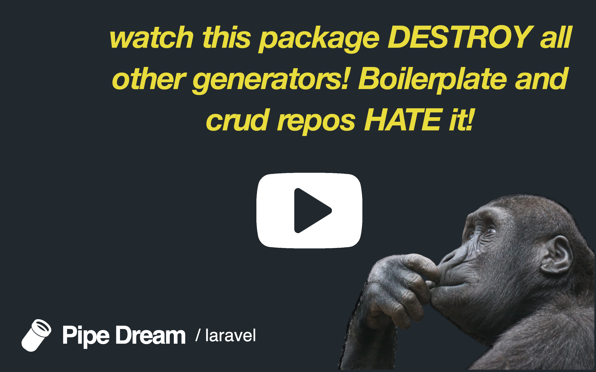
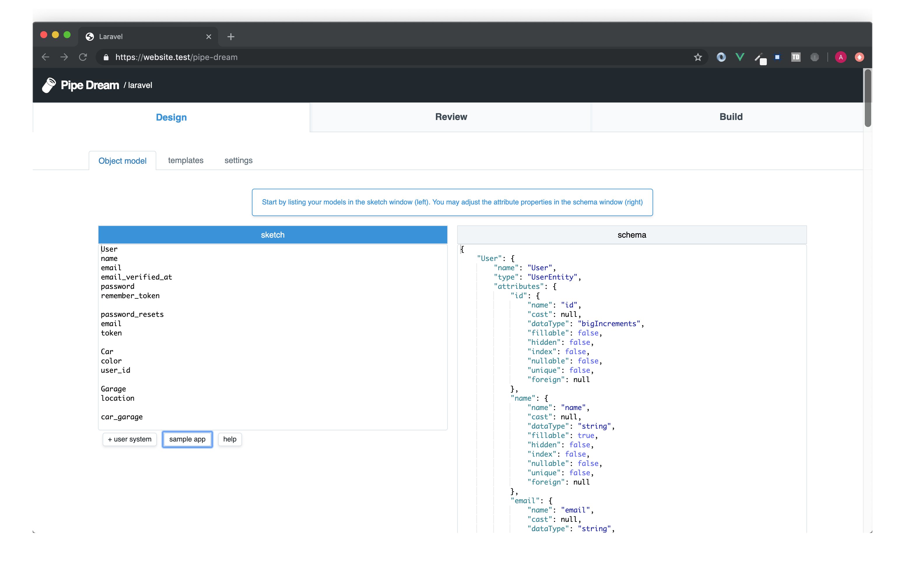
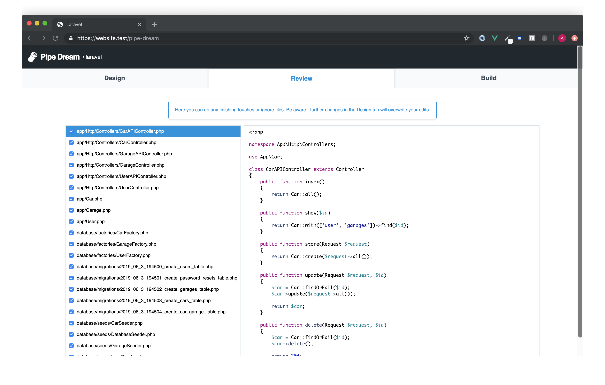
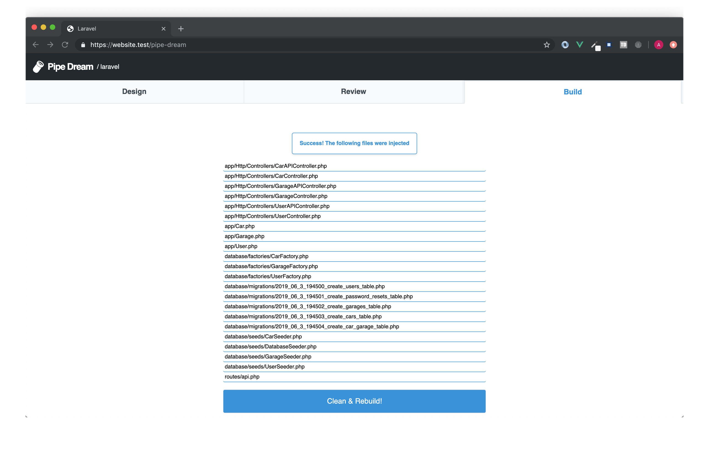
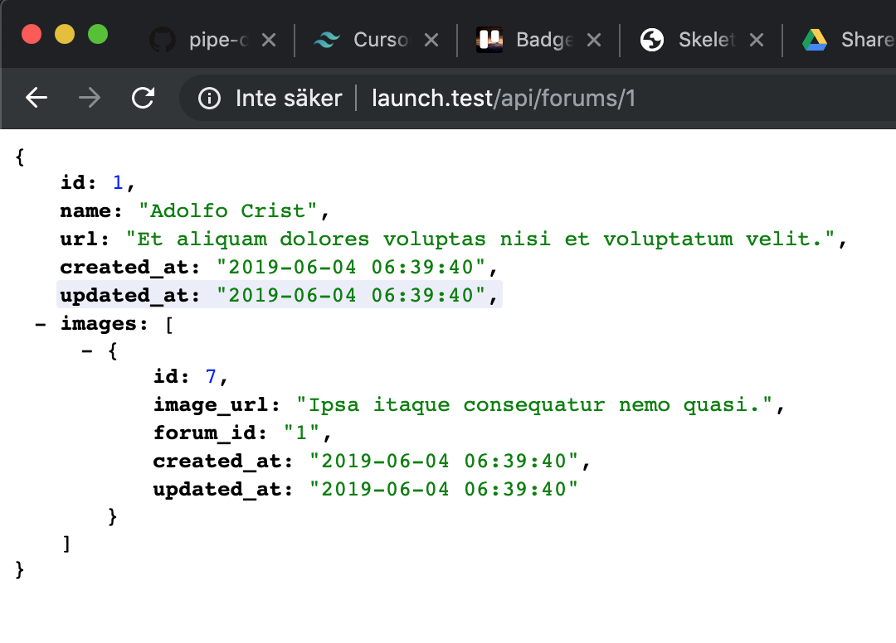

[](https://packagist.org/packages/pipe-dream/laravel-create)
[](https://packagist.org/packages/pipe-dream/laravel)
[](https://packagist.org/packages/pipe-dream/laravel-create)


Create new web projects really fast. By  giving Pipe Dream a minimum of input in form of a sketch/entity list it will predict your application schema and feed it into a set of pipes. These pipes will generate all the files needed to get started really quick.

<a href="https://www.youtube.com/watch?v=doUlmZdvP1o" target="_blank">

</a>

## Installation

Install Pipe Dream
```bash
composer require --dev pipe-dream/laravel-create
```

Install the Laravel File Factory
```bash
npm install --dev @pipe-dream/laravel-file-factory
```
More File Factories can be found [here](https://github.com/topics/pipe-dream-file-factory)

Build Pipe Dream
```bash
php artisan php artisan pipedream:build
```

Thats it, now open your browser and go to `/pipe-dream` and start designing.

## Usage
If you havent already, [watch the 2 minute video](https://www.youtube.com/watch?v=doUlmZdvP1o).

* List your models and tables in the sketch window. Note the schema is created in real-time and is being displayed on the right side of the screen.

<kbd></kbd>

* Here are some pointers on the sketch syntax
```js
// use PascalCase for models
Garage
location
capacity

// Separate your entities into chunks
Car
color
user_id // foreign key

// use snake_case model1_model2 to setup a ManyToMany relationship
car_garage 

// use button to add a default user system
User 
name
email
email_verified_at
password
remember_token

// use snake_case to create a table
password_resets
email
token
```

 * Review the list of files that are going to be created.

<kbd></kbd>

* Commit the files to disk.

<kbd></kbd>

* You are now ready to migrate and seed. Go ahead and check out the API (at `/api`), that contains placeholder values 

<kbd></kbd>

## Contributing
PRs and issues are welcome. In addition to the issue section we have a [Trello board](https://trello.com/b/R11mhfdy/pipe-dream) listing things that we need help with.
To get started and to learn more about the platform check out [pipe-dream/docs](https://github.com/pipe-dream/docs)

## License
MIT

## Stay tuned!
Follow me on twitter: [@ajthinking](https://twitter.com/ajthinking)

<a href="https://www.patreon.com/ajthinking" >Help me continue this work | Patreon</a>
